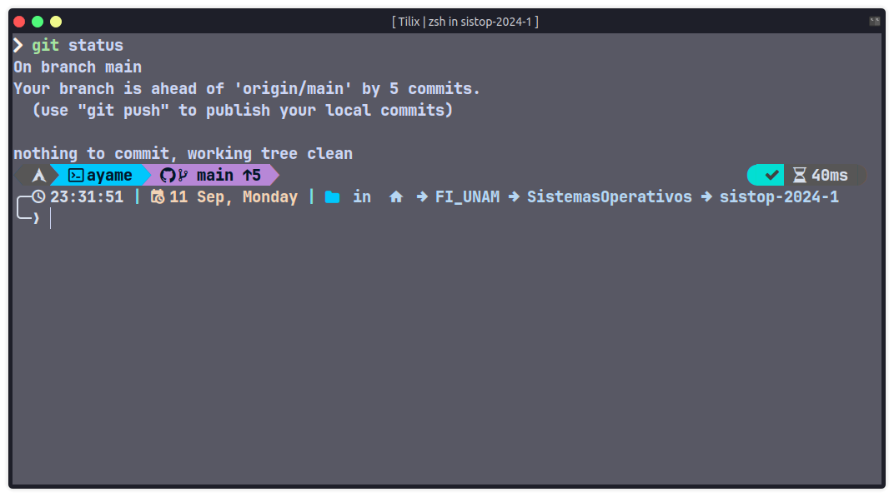
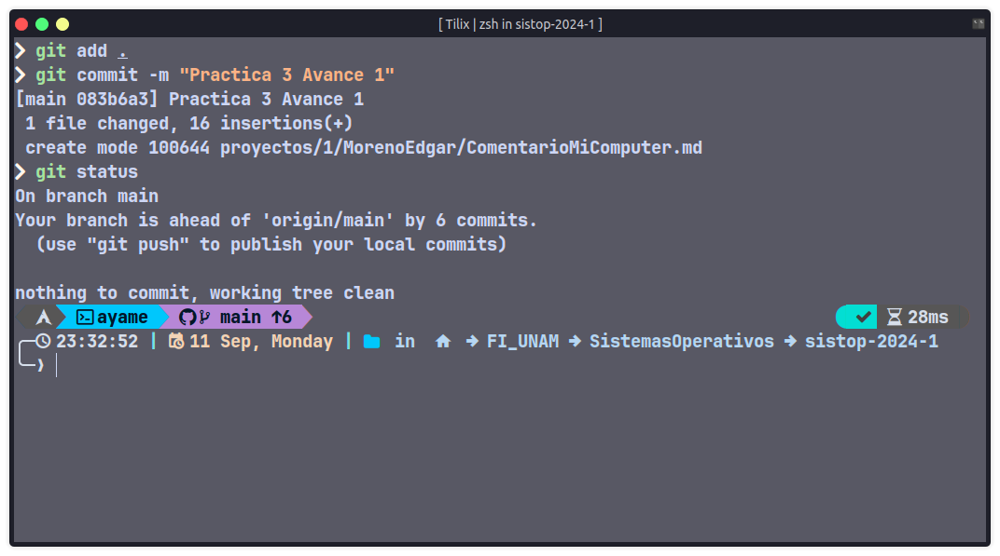
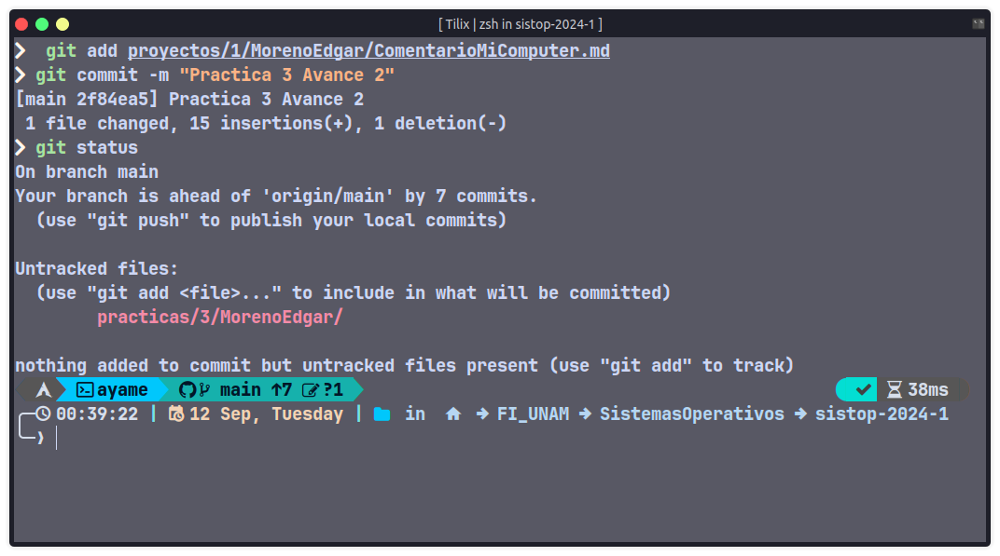
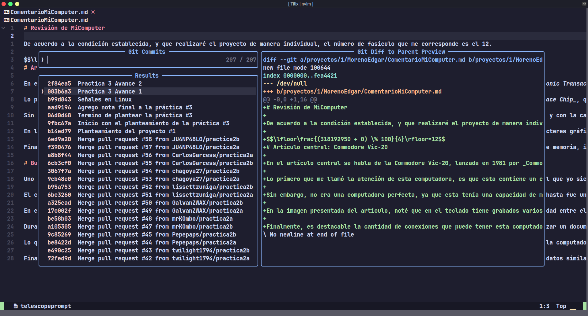
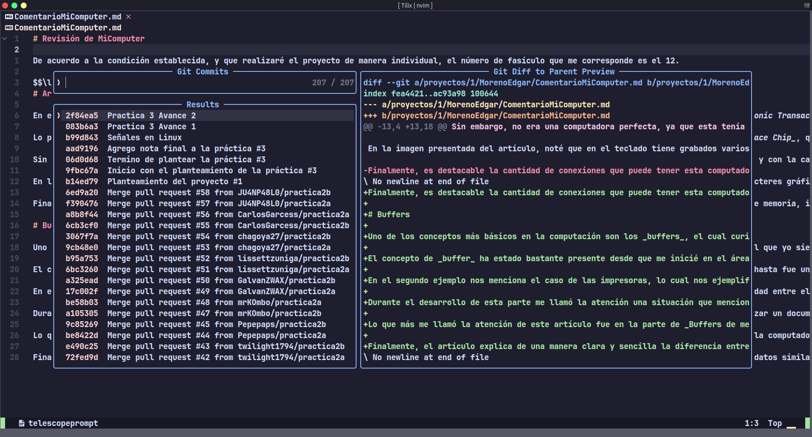

# Práctica 3

## Estado del repositorio antes de iniciar el proyecto

En esta primera parte se observa que la rama main está adelantada 5 commits.

## Estado del repositorio posteriormente del primer commit

En esta segunda parte se observa que la rama main está adelantada 6 commits, ya que se agregó el primer avance.

## Estado del repositorio luego del segundo commit con el proyecto listo para la entrega

En esta tercera parte se observa que la rama main está adelantada 7 commits, ya que se agregó el primer avance.
Además se observa que los archivos correspondientes a esta práctica aún no han sido agregados al repositorio.

# Comparación del archivo

## Diferencia del primer commit

## Diferencia del segundo commit

