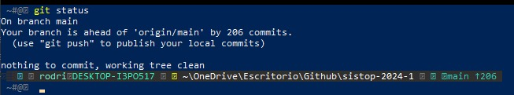

# Práctica 3

### Osorio Rodrigo y Robles Alan

# Número de cuenta. 
- Osorio Angeles Rodrigo Jafet = 318008893
- Robles Reyes Alan = 115002762

# Desarrollo. 

Tenemos el primer repositorio en limpio antes de iniciar el proyecto 1 y comenzar con el historial de cambios para las reseñas del fasículo que nos tocó. 

Se crea la rama practica 1 para comenzar la primer reseña. Por lo tanto, se realiza el primer commit de la reseña central a mi repositorio de gitHub (RodrigoJOsorio) para que mi compañero Alan Robles, pueda hacer un fork y realizar sus modificaciones del archivo. 

Aquí podemos observar que mi compañero trabajo sobre el archivo que yo creé. 

Finalmente, podemos observar que en mi repositorio se ha actualizado de forma correcta, se puede visualizar el trabajo de reseña completa. 