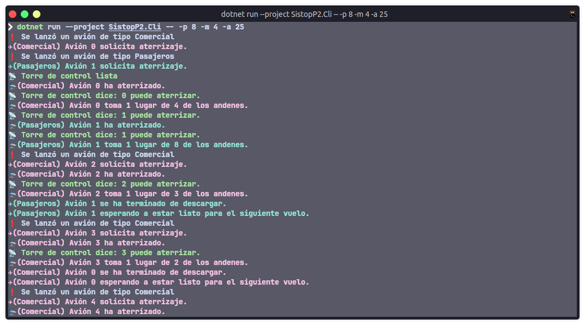

# Proyecto: Aereopuerto.

## Integrantes del equipo.
- Moreno Chalico Edgar Ulises
- Osorio Ángeles Rodrigo Jafet

## Identificación del problema.

Para poder viajar a otros países de manera más rápida y eficaz, o transportar mercancías, debemos tener en cuenta el uso de viajes por avión. Nuestro problema de paralelización se basa en el aeropuerto. 

### Descripción del problema.

En un aeropuerto se tienen zonas específicas de operación y sincronización para los despegues y el aterrizaje de los aviones. Por lo que tenemos que considerar las siguientes áreas en el planteamiento: 

- Andenes para pasajeros y comercial. 
- Torre de control (comunicación).
- Pista de aterrizaje/despegue. 
- Área de abordaje y descenso de pasajeros.
- Área de carga y descarga comercial.

En el contexto de un proyecto de paralelismo, se conoce que se recibe un flujo constante de solicitudes de aterrizaje en la pista de aterrizaje, y estas solicitudes son manejadas por la torre de control. La torre de control debe administrar los aterrizajes y despegues en función del orden en que llegan las solicitudes de los aviones, asegurando que ninguno de los aviones quede esperando indefinidamente. Cada avión que aterriza regresará a despegar después de dejar a sus pasajeros o mercancía y ser cargado nuevamente con pasajeros o mercancía.

El área de abordaje/descenso de pasajeros puede manejar simultáneamente hasta 10 aviones, mientras que el área de carga/descarga de mercancía puede operar con hasta 6 aviones de carga al mismo tiempo. Cuando un avión no puede aterrizar, se le mantendrá en espera en la zona aérea designada, y si un avión no puede despegar, se quedará en la zona de espera en tierra.

## Planteamiento y estrategia del programa.

Se maneja la sincronización y los procesos paralelos mediante la torre de control, ya que es la encargada de tener el orden y funcionamiento de las operaciones de los aviones y las pistas de aterrizaje/despegue. Por lo que tenemos declarado la función para la torre de la siguiente manera: 

 ```csharp
private static void TorreControl(CancellationToken token)
    {
        AnsiConsole.MarkupLine("[green]:satellite_antenna: Torre de control lista[/]");
        while (!token.IsCancellationRequested)
        {
            ComunicacionTorre.Wait();
            var mensaje = _solicitud.Split(",", StringSplitOptions.TrimEntries);
            AnsiConsole.MarkupLine($"[green]:satellite_antenna: Torre de control dice: {mensaje[0]} puede {mensaje[1]}.[/]");
            PistaAterrizaje.Release();
            ComunicacionAvion.Release();
        }
    }
  ```
Observamos que tiene una comunicación con el avión, por lo que, recibe las solicitudes de la operación a realizar. Se verifica esta solicitud con la parte `mensaje` y `_solicitd.Split(...)`, que separa el mensaje para revisar el avión y la acción a realizar; considerando este indica si se puede o no realizar la acción. 

Una vez que un avión aterriza, este se retira a un andén, donde se descarga, y posteriormente vuelve a ser cargado para realizar otro viaje.

```csharp
        ...
        AnsiConsole.MarkupLine($"[{color}]:airplane_arrival:({tipoStr}) Avión {id} ha aterrizado.[/]");
        anden.Wait();
        AnsiConsole.MarkupLine($"[{color}]:airplane_arrival:({tipoStr}) Avión {id} toma 1 lugar de {anden.CurrentCount + 1} de los andenes.[/]");
        Thread.Sleep(Random.Shared.Next(1000, 4000));
        AnsiConsole.MarkupLine($"[{color}]:airplane:({tipoStr}) Avión {id} se ha terminado de descargar.[/]");
        AnsiConsole.MarkupLine($"[{color}]:airplane:({tipoStr}) Avión {id} esperando a estar listo para el siguiente vuelo[/].");
        Thread.Sleep(Random.Shared.Next(1000, 4000));
        anden.Release();
        AnsiConsole.MarkupLine($"[{color}]:airplane:({tipoStr}) Avión {id} solicitando despegue.[/]");
        ...
```


Por otro lado, el avión puede solicitar una acción utilizando la variable `_solicitud`, en la cual se envía el mensaje _codificado_, el cual consiste en el id del avión, y la acción que desea realizar.
Estas acciones son aterrizar y despegar.
```csharp
    private static void Avion(int id, TipoAvion tipo)
    {
        ...
        AnsiConsole.MarkupLine($"[{color}]:airplane:({tipoStr}) Avión {id} solicita aterrizaje.[/]");
        ComunicacionAvion.Wait();
        _solicitud = $"{id},aterrizar";
        ComunicacionTorre.Release();
        ...
```

Para categorizar los aviones (y no repetir dos veces la función `Avion` para cada tipo distinto), se utiliza un enum, el cual tiene las dos categorías.

```csharp
    private enum TipoAvion
    {
        Comercial,
        Pasajeros
    }
```

Esta categoría se asigna de manera aleatoria al crear su proceso.

```csharp
        for (var i = 0; i < _numeroAviones; i++)
        {
            var tipo = Random.Shared.Next(0, 2) == 0 ? TipoAvion.Pasajeros : TipoAvion.Comercial;
            var id = i;
            var task = new Task(() => Avion(id, tipo));
            task.Start();
            AnsiConsole.MarkupLine($"[default]:red_exclamation_mark: Se lanzó un avión de tipo {tipo.ToString()}[/]");
            aviones.Add(task);
            await Task.Delay(Random.Shared.Next(500, 1000));
        }
```

Al llamar la función, se asigna su andén correspondiente, y un color distinto, a partir del valor `TipoAvion` asignado.

```csharp

    
    private static void Avion(int id, TipoAvion tipo)
    {
        var anden = tipo == TipoAvion.Comercial ? _andenMercancia : _andenPasajeros;
        var tipoStr = tipo.ToString();
        var color = tipo == TipoAvion.Comercial ? "purple" : "teal";
        ...
```


## Lenguaje de programación y entorno.

Este programa fue desarrollado en el lenguaje de programación C# (.NET 7), en el sistema operativo Linux.

Para ejecutarlo se necesita el paquete `dotnet`.

Argumentos disponibles:
```
dotnet run --project SistopP2.Cli -- --help
  -a, --aviones=VALUE        Número de aviones a lanzar. Default = 15.
  -p, --pasajeros=VALUE      Número de andenes de pasajeros. Default = 6.
  -m, --mercancia=VALUE      Número de andenes de mercancía. Default = 2.
  -h, --help                 Show help
```

Por ejemplo, para lanzar el programa con 25 aviones, 4 andenes de mercancía y 8 de pasajeros, el programa se lanza con el siguiente comando:

```
dotnet run --project SistopP2.Cli -- -p 8 -m 4 -a 25
```

## Capturas de la ejecución.

Inicio de la ejecución:



Final de la ejecución:
