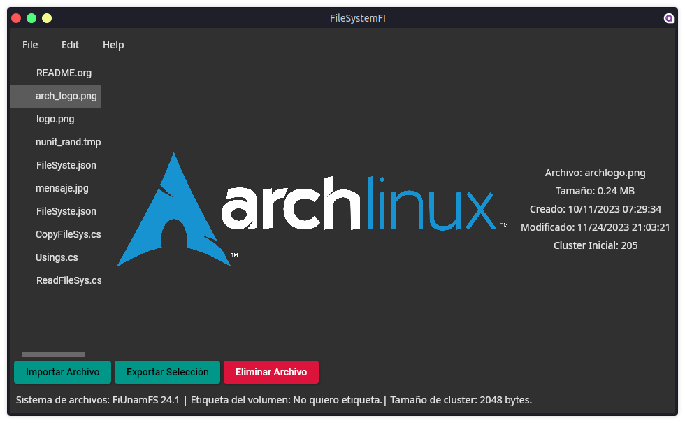
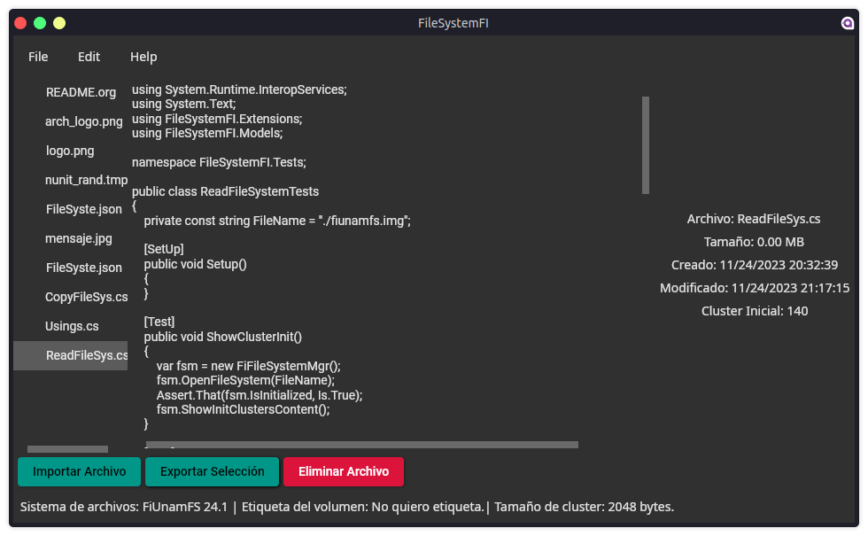

# Proyecto 3: (Micro) sistema de archivos

- Moreno Chalico Edgar Ulises
- Robles Reyes Alan

## Problema a resolver

Desarrollar un programa que pueda obtener,
crear y modificar información en el micro-sistema-de-archivos de la
Facultad de Ingeniería, =FiUnamFS=.

- [x] Listar los contenidos del directorio
- [x] Copiar uno de los archivos de dentro del =FiUnamFS= hacia tu sistema
- [x] Copiar un archivo de tu computadora hacia tu =FiUnamFS=
- [x] Eliminar un archivo del =FiUnamFS=
- [ ] Desfragmentar el sistema de archivos.

## Entorno y dependencias

El programa está desarrollado en C# (.NET 7).
Para la interfaz de usuario se utilizó [Avalonia](https://avaloniaui.net), un framework de interfaz de usuario que al igual que .NET, es de código abierto, el cual permite desarrollar aplicaciones de escritorio multiplataforma que se ejecutan en Windows, Linux, MacOS, Android, iOS, web y en dispositivos embebidos. Este está basado en el patrón _model-view-viewmodel_ (MVVM). Para agilizar el desarrollo con este patrón, se utilizó además la biblioteca [CommunityToolkit.Mvvm](https://github.com/CommunityToolkit/dotnet).

Adicionalmente, se agregaron pruebas unitarias con [NUnit](https://nunit.org/), estas se utilizaron para ir probando los cambios en el programa de una manera más rápida sin depender de la GUI, así como para comprobar que todo se mantenga funcionando correctamente.

## Uso del programa

En el menú superior, se puede cargar el sistema de archivos, esto habilitará el resto de la interfaz, y permitirá manipular el sistema de archivos.

## ¿Cómo funciona?

La lógica principal del programa se encuentra en el archivo `FiFileSystemMgr.cs`, este se encarga de administrar el sistema de archivos mediante el uso de un `FileStream`, que accede al archivo, un `BinaryReader`, que lee el contenido del archivo, y un `BinaryWriter`, que se encarga de escribir contenidos al archivo.

```csharp
    _fs = new FileStream(filePath, FileMode.Open, FileAccess.ReadWrite);
    _br = new BinaryReader(_fs);
    _bw = new BinaryWriter(_fs);
```

Para leer, por ejemplo, el superbloque, se utiliza `BinaryReader` para leer cada tipo de dato que se requiera.

```csharp
    Identifier = _br.ReadString(8);
    if (Identifier != "FiUnamFS")
        throw new Exception("El sistema de archivos no es válido (Debe ser FiUnamFS)");
    _br.ReadBytes(2);
    Version = _br.ReadString(4);
    _br.ReadBytes(6);
    Volume = _br.ReadString(19);
    ClusterSize = _br.ReadInt32LitEnd();
    DirClusterSize = _br.ReadInt32LitEnd();
    FullClusterSize = _br.ReadInt32LitEnd();

    IsInitialized = true;
    Files = GetAllFiles();
```

La clase `BinaryReader` por sí sola no puede leer números enteros de 32 bits con formato _Little Endian_, pero mediante extensión de funciones de C# se agrega esta función.

```csharp
public static class BinaryReaderExtensions
{
    public static int ReadInt32LitEnd(this BinaryReader br) =>
        BitConverter.ToInt32(br.ReadBytes(4).Reverse().ToArray(), 0);
}

```

Para escribir sobre el archivo se utiliza `BinaryWriter`, dependiendo del tipo de dato, puede requerir tratarse previamente o se escribe directamente.

```csharp
    private void WriteFileData(FiFile file, long infoSpace)
    {
        _bw.BaseStream.Position = infoSpace;
        var buffer = new byte[64];
        var bufferIndex = 0;

        BitConverter.GetBytes(file.Type).CopyTo(buffer, bufferIndex);
        bufferIndex += 1;

        var fileNameBytes = Encoding.ASCII.GetBytes(file.FileName!);
        fileNameBytes.CopyTo(buffer, bufferIndex);
        bufferIndex += fileNameBytes.Length;

        BitConverter.GetBytes(file.Size).Reverse().ToArray().CopyTo(buffer, bufferIndex);
        bufferIndex += sizeof(int);

        ...

        var modDateBytes = file.LastModifiedDate.ToString("yyyyMMddHHmmss").ToCharArray().Select(c => (byte)c).ToArray();
        modDateBytes.CopyTo(buffer, bufferIndex);
        bufferIndex += modDateBytes.Length;

        if (bufferIndex > 0)
        {
            _bw.Write(buffer, 0, bufferIndex);
        }
    }

```

Es importante siempre cerrar todos los streams al finalizar el programa, al cerrar la interfaz o desde la opción para cerrar el archivo, se llama a los métodos propios que cierran el sistema de archivos. Además la clase utiliza la interfaz `IDisposable`, por lo que puede usarse con `using` y al finalizar su uso, se cierra automátiamente.

```csharp
    public void Dispose()
    {
        IsInitialized = false;
        _fs.Dispose();
        _br.Dispose();
        _bw.Dispose();
        GC.SuppressFinalize(this);
    }
```

## Capturas del programa



