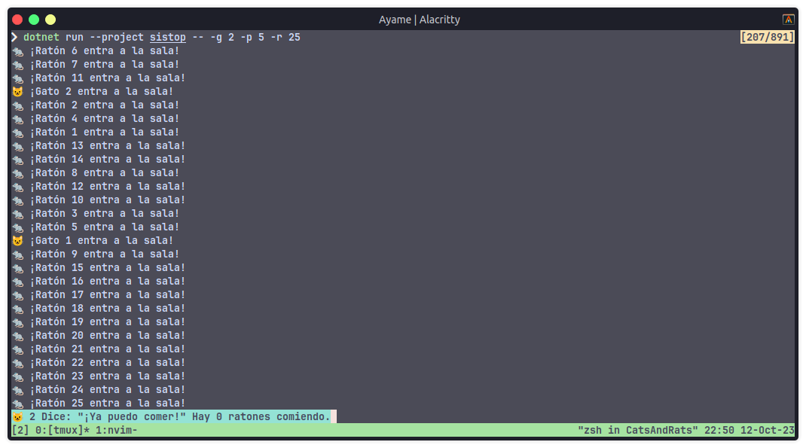
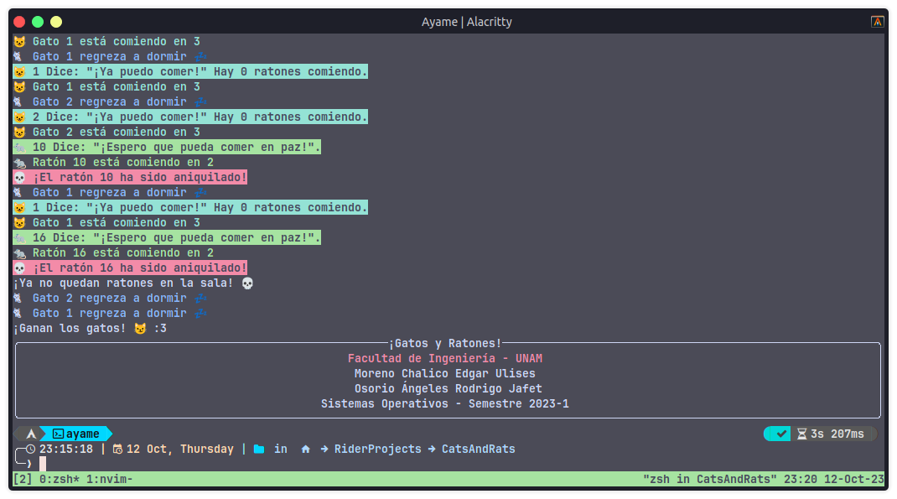

# Ejercicio de sincronización

## Integrantes del equipo
- Moreno Chalico Edgar Ulises
- Osorio Ángeles Rodrigo Jafet

## El problema a resolver

El ejercicio resuelto es: "De gatos y ratones"

### Planteamiento del programa

Tengo k gatos (y desafortunadamente, l ratones) en mi casa. Le sirvo la comida a mis gatos en m platos. Gatos y ratones han llegado a un acuerdo para repartirse el tiempo y comida, pero tienen que convencerme de que están haciendo su trabajo.

- Los gatos pueden comer de sus m platos de comida.
- Los ratones pueden comer de esos mismos platos siempre y cuando no sean vistos.
- Si un gato ve a un ratón comiendo, se lo debe comer (para mantener su reputación)
- Los platos están puestos uno junto al otro
- Sólo un animal puede comer de cada plato a la vez
- Si un gato está comiendo y un ratón comienza a comer de otro plato, el gato lo ve (y se lo come).
- Por acuerdo de caballeros, los gatos no se van a acercar a los platos mientras hay ratones comiendo.
Evitar la inanición.

## Lenguaje de programación y entorno

Este programa fue desarrollado en el lenguaje de programación C# (.NET 7), totalmente en Linux.

Para ejecutarlo se necesita el paquete `dotnet`.

Dependiendo de la distribución puede cambiar el método para ejecutarlo, en Ubuntu y Arch ya viene dentro de los repositorios por defecto, pero para Debian al parecer no. En dado caso, para instalarlo es mediante estos comandos:


```bash
wget https://packages.microsoft.com/config/debian/12/packages-microsoft-prod.deb -O packages-microsoft-prod.deb
sudo dpkg -i packages-microsoft-prod.deb
rm packages-microsoft-prod.deb

sudo apt-get update && sudo apt-get install -y dotnet-sdk-7.0
```

Tomados desde el <a href="https://learn.microsoft.com/en-us/dotnet/core/install/linux-debian" target="_blank">sitio oficial.</a>


Busqué si había otra alternativa sin `dotnet`, como el proyecto Mono, pero el compilador no tiene soporte para la versión de .NET utilizada. Tanto `csc` y `mcs` no pueden compilar el proyecto, una disculpa :c.
  
## Estrategia de sincronización

La estrategia utilizada para resolver este problema fue _Semáforos_ y  _Apagadores_. Estos se utilizan para controlar el acceso de los procesos a los recursos compartidos y el acceso a (en este caso) los platos de comida.

## Ejecución del programa

Desde el directorio _CatsAndRats_

```shell
cd CatsAndRats
```

Primero hay que restaurar el proyecto para descargar los paquetes necesarios (`Spectre.Console` y `Mono.Options`).

```shell
dotnet restore
```

El programa tiene algunos parámetros que se pueden cambiar mediante el paso de argumentos desde la terminal, los cuales son los siguientes.

```shell
  -g, --gatos=VALUE          Conteo de gatos. Default = 5.
  -r, --ratones=VALUE        Conteo de ratones. Default = 5.
  -p, --platos=VALUE         Número de platos disponibles. Default = 5.
  -h, --help                 Show help
```

Comando para ejecutar el programa con dos gatos, cinco platos y 20 ratones:

```shell
dotnet run --project sistop -- --gatos 2 --platos 5 --ratones 20
```

O más reducido:

```shell
dotnet run --project sistop -- -g 2 -p 5 -r 2
```

Toda la documentación está en el código fuente.

## Capturas de la ejecución

Inicio de la ejecución



Final de la ejecución


