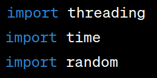
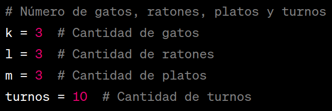
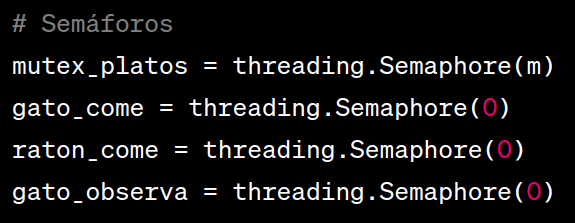
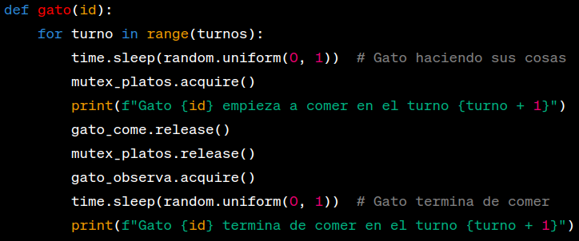
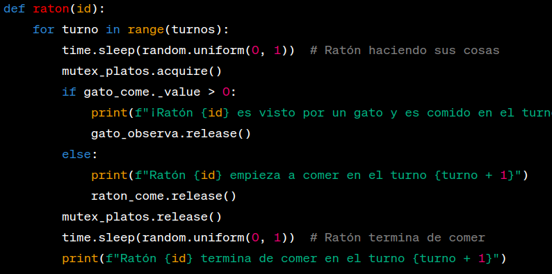
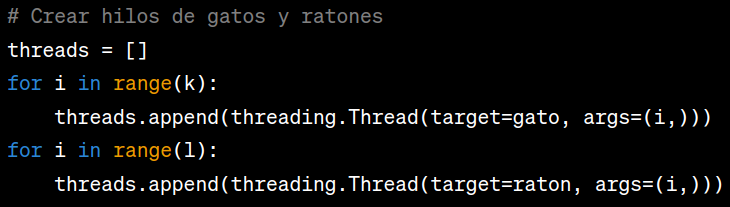
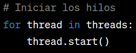
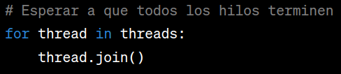

  

# Ejercicio de sincronización

**_Robles Reyes Alan_**

## :bulb: Ejercicio

gatos :cat2: y ratones :mouse2:. 

## :raised_hands: ¿Por qué?

Porque me gustan los gatos :cat: :black_heart:

## :nerd_face: Planteamiento

Tengo _k_ gatos (y desafortunadamente, _l_ ratones) en mi casa. Le sirvo la comida a mis gatos en _m_ platos. Gatos y ratones han llegado a un acuerdo para repartirse el tiempo y comida, pero tienen que convencerme de que están haciendo su trabajo.

## :memo::pencil: Reglas

- Los gatos pueden comer de sus m platos de comida.
- Los ratones pueden comer de esos mismos platos siempre y cuando no sean vistos.
- Si un gato ve a un ratón comiendo, se lo debe comer (para mantener su reputación)
- Los platos están puestos uno junto al otro
  - Sólo un animal puede comer de cada plato a la vez
  - Si un gato está comiendo y un ratón comienza a comer de otro plato, el gato lo ve (y se lo come).
  - Por acuerdo de caballeros, los gatos no se van a acercar a los platos mientras hay ratones comiendo.
- Evitar la inanición.

## Lenguaje

El programa fue desarrollado en **python** y para ejecutarlo se necesita poner lo siguiente: _"python3 tarea.py"_

## Estrategia de sincronización

El patrón de diseño utilizado en este código es el patrón de "Semáforos" o "Mutexes". Los semáforos se utilizan para controlar el acceso a recursos compartidos, en este caso, los platos de comida. Los semáforos actúan como mecanismos de sincronización que permiten a los gatos y ratones coordinar sus acciones, evitando que varios accedan a un plato al mismo tiempo y asegurando que se cumplan las reglas del ejercicio.

## Explicación del código [_tarea.py_](tarea.py)

  - ### " Importación de bibliotecas "

    Se importan las bibliotecas necesarias: **'threading'** para trabajar con hilos, **'time'** para introducir retrasos simulados y **'random'** para generar valores aleatorios.

    

  - ### " Definición de variables "

    Se definen las variables que especifican la cantidad de gatos, ratones, platos y turnos.

    

  - ### " Inicialización de semáforos "

    Se crean varios semáforos que se utilizan para coordinar el comportamiento de gatos y ratones. Cada semáforo tiene un propósito específico: **'mutex_platos'** para controlar el acceso a los platos, **'gato_come'** para señalizar que un gato comienza a comer, **'raton_come'** para señalizar que un ratón comienza a comer y **'gato_observa'** para señalizar que un gato ve a un ratón comiendo.

    

  - ### " Definición de funciones para gatos y ratones "

    Se definen las funciones que representan el comportamiento de gatos y ratones. Estas funciones se ejecutarán en hilos separados.

    

     
    

  - ### " Creación de hilos "

    Se crean hilos para gatos y ratones y se agregan a una lista de hilos **'threads'**.

    

  - ### " Inicio de hilos "

    Todos los hilos se inician, lo que ejecutará las funciones **'gato'** y **'raton'** en paralelo.

    

  - ### " Espera a que todos los hilos terminen "

    El programa principal espera a que todos los hilos terminen su ejecución antes de continuar.

    

  - ### " Mensaje de finalización "

    Se muestra un mensaje que indica que todos los gatos y ratones han terminado sus actividades.

    

