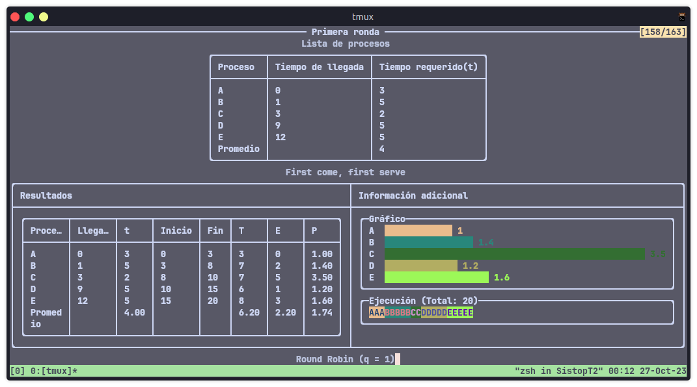
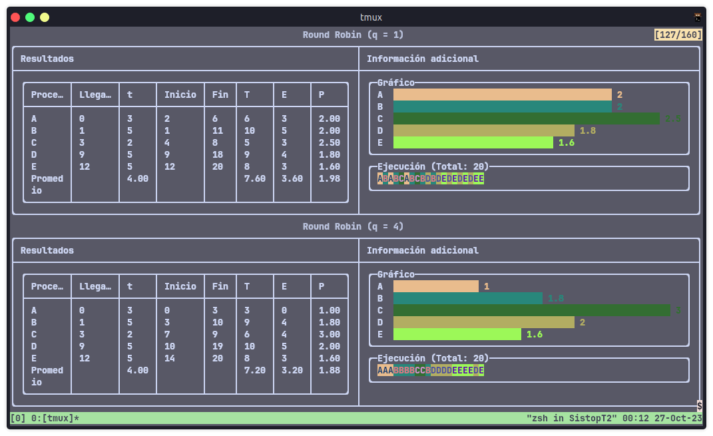
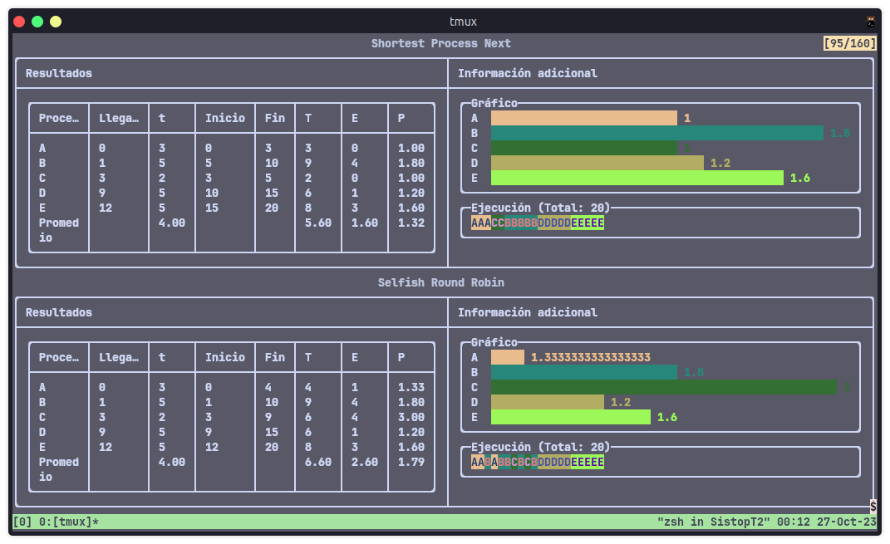

# Comparación de Planificadores

## Integrantes del equipo
- Moreno Chalico Edgar Ulises
- Osorio Ángeles Rodrigo Jafet


## Lenguaje de programación y entorno

Este programa fue desarrollado en el lenguaje de programación C# (.NET 7).

## Ejecución del programa

Desde el directorio _SistopT2_

```shell
cd SistopT2
```

Ejecución con `dotnet`.


```
dotnet run --project Tarea2
```

Se creó la opción de crear una ronda aleatoria, sin embargo esta a veces falla, debido al acomodo de los procesos, por lo que se necesitaría de otra forma para crearlos aleatoriamente.

```
dotnet run --project Tarea2
```


## Capturas de la ejecución




